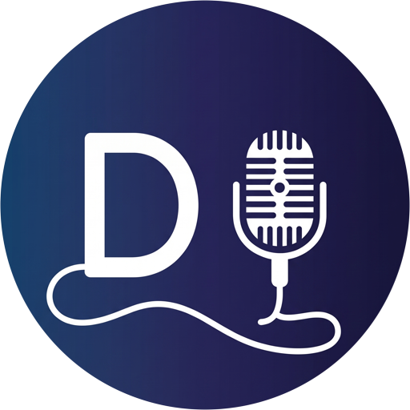

<div align="center">



# DubRust

**Dubbing and voice-over studio for your desktop — written in Rust.**\
Auto-slice speech into phrases, record takes phrase by phrase, mix and export the video.

[](https://github.com/arcisq/dubrust/actions/workflows/ci.yml)
[](https://github.com/arcisq/dubrust/releases/latest)
[](https://github.com/arcisq/dubrust/releases)
[](LICENSE)
[](https://www.rust-lang.org)
[](#requirements)

[Download](https://github.com/arcisq/dubrust/releases/latest) ·
[Features](#features) ·
[Build](#build-from-source) ·
[Shortcuts](#shortcuts) ·
[License](#license)

</div>

---

> [!NOTE]
> **Disclaimer**: This project was vibe-coded for personal use. Expect some spaghetti code and quirks under the hood — constructive Issues, feedback, and Pull Requests are warmly welcome! 🦀✨

Desktop application written in Rust + egui for video dubbing: automatic speech slicing into phrases, phrase-by-phrase microphone recording, and final mix assembly.

## Features

- Open video via file dialog (`mp4`, `mkv`, `mov`, `avi`, `webm`, `m4v`).
- Automatic speech slicing into phrases: FireRedVAD (neural SOTA VAD, 2.3 MB) or built-in DSP algorithm based on silence threshold. Automatic fallback to DSP if needed.
- Timeline with waveform, phrase zones, recorded take indicators, and navigation by click or drag.
- Video preview with frames decoded via ffmpeg, preserving aspect ratio and synchronized with audio playhead.
- Phrase-by-phrase take recording with microphone level meter, clipping warnings, and dropout diagnostics.
- Take deletion with undo support via `Ctrl+Z`.
- Autosave project to `project.json` next to the video and instant restoration upon re-opening.
- Re-slicing without losing recordings: takes are mapped to new phrases by maximum interval overlap.
- Four mix modes:
  1. **Dub voice only** (Default): Original track is muted, only your clean voice takes are included.
  2. **Dubbing + clean BGM (HT-Demucs)**: Original voice is removed by deep learning, keeping clean background music and sound effects under your voice.
  3. **Replace speech**: Original audio is muted under recorded phrases and plays normally in unrecorded sections.
  4. **Voice-over with ducking**: Original audio plays at a reduced volume underneath your voice.
- Mix settings: volume of takes, original audio, and isolated background, ducking level, take fitting (time-stretch without pitch shift), normalization.
- Export final video with multi-stage progress reporting; video stream is copied without re-encoding.

> [!IMPORTANT]
> **Hardware & Performance Profile**:
> - **Core App & FireRedVAD**: 100% lightweight pure-Rust. Runs with near-zero CPU and RAM overhead on virtually any machine.
> - **Advanced Stem Separation (HT-Demucs)**: Optional pro feature that loads a heavy neural network (~166 MB weights + ONNX Runtime). High-quality vocal/background separation requires mid-range to high-end hardware (modern multi-core CPU). Weights are not bundled and are downloaded on demand from Hugging Face.

## Requirements

- Windows / Linux / macOS with audio input and output.
- `ffmpeg` and `ffprobe` in `PATH` — required (audio extraction, frame pumping, multiplexing).
- Built-in FireRedVAD runs in 100% pure Rust without Python or external runtime dependencies.

## Download

Grab the latest Windows build from the [Releases page](https://github.com/arcisq/dubrust/releases/latest):
unpack the archive, make sure `ffmpeg` is in `PATH`, and run `dubrust.exe`.
No installer, no telemetry, no bundled model weights.

## Build from source

```powershell
git clone https://github.com/arcisq/dubrust.git
cd dubrust
cargo run --release
```

Run tests:

```powershell
cargo test
```

The FireRedVAD model (2.3 MB) is committed in `models/` and embedded into the binary at compile
time, so a fresh clone builds and slices speech without downloading anything.

## Shortcuts

| Key | Action |
| --- | --- |
| `Space` | Play selected phrase / Pause |
| `R` | Start / Stop recording take |
| `T` | Listen to recorded take |
| `Shift+T` | Listen to the take alone (solo, no bed) |
| `Enter` | Record / re-record the selected phrase |
| `Tab` | Toggle focus mode (one phrase at a time) |
| `←` / `→` | Previous / Next phrase |
| `Delete` / `Backspace` | Delete phrase take |
| `Ctrl+Z` | Restore deleted take |

Shortcuts do not trigger while a text field is focused.

## Project File Layout

A `<video_name>.dubrust` folder is created next to the video:

```
clip.dubrust/
  audio.wav          — extracted original audio track
  background.wav     — isolated BGM/ambient track (optional)
  project.json       — phrases, settings, mix mode
  takes/             — recorded takes (take_001_01.wav, etc.)
  takes/.trash/      — deleted takes for undo
```

If the folder next to the video is not writable, the project falls back to `%TEMP%\dubrust`.

## Code Structure

```
src/
  main.rs          — entry point and window configuration
  lib.rs           — public library modules
  app.rs           — application state and action logic
  models.rs        — phrases, settings, modes, waveform
  project.rs       — file layout, saving, trash, take remapping
  tasks.rs         — background worker: opening, slicing, export, model download
  util.rs          — timecodes, hidden console processes
  audio/           — wav, dsp, demucs (HT-Demucs ONNX), waveform, player, recording
  slicer/          — VAD: FireRedVAD (pure Rust) and DSP algorithm
  video/           — ffprobe/ffmpeg, frame pump, mixing and multiplexing
  ui/              — rendering only: panels, timeline, phrase list, video
tests/             — unit & integration tests
models/            — firered_vad.onnx (2.3 MB)
```

All heavy work (ffmpeg, VAD, HT-Demucs inference, mixing) runs in a background worker thread and communicates with the UI via channels, ensuring the interface never freezes.

## Known Limitations

- Preview is decoded via ffmpeg frame-by-frame; lowering preview resolution can improve playback on older systems.
- Phrase boundaries cannot be dragged by mouse yet — adjust by re-slicing with different sensitivity settings.
- Recording captures the system's default input device.

## License

DubRust is free software under the **GNU Affero General Public License v3.0 or later** (`AGPL-3.0-or-later`). Full text is in the [LICENSE](LICENSE) file.

Copyright (C) 2026 Arcis (arcisq)

What this means in practice:
- Anyone can use, study, modify, and distribute the code.
- Derivative works must be distributed under the same license with source code.
- Additional AGPL condition (Section 13): if a modified version is provided to users over a network (web service, SaaS dubbing, etc.), the source code of that version must be offered to its users. For local desktop execution, this condition is not triggered.

Dependencies and external tools are detailed in [THIRD-PARTY-LICENSES.md](THIRD-PARTY-LICENSES.md).
DubRust code is licensed under AGPLv3. Third-party models (HT-Demucs by Meta Research, FireRedVAD by FireRedTeam) are downloaded separately by the user on demand and are subject to their respective original licenses.
`ffmpeg` and `ffprobe` are invoked as external tools and are not bundled into the binary.

---

*Disclaimer: DubRust is an independent open-source project and is not affiliated with, endorsed by, or sponsored by the Rust Project or the Rust Foundation.*
